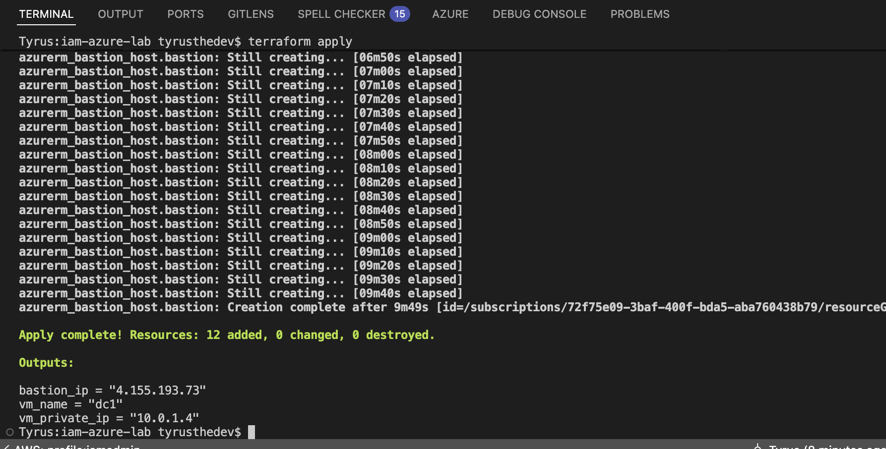
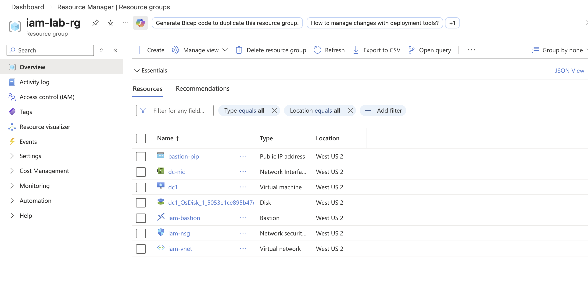
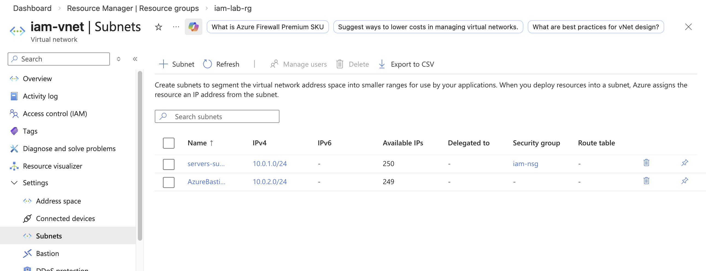
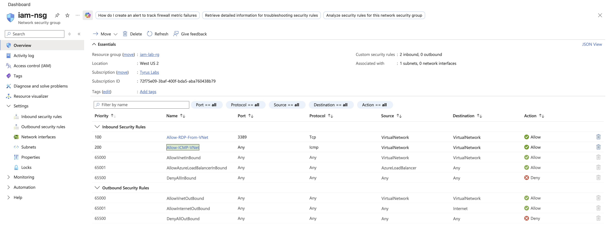
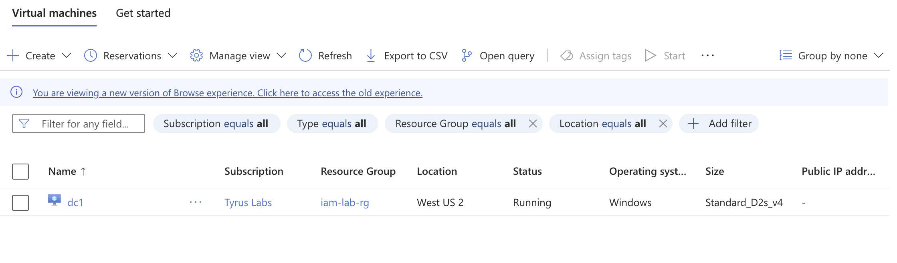
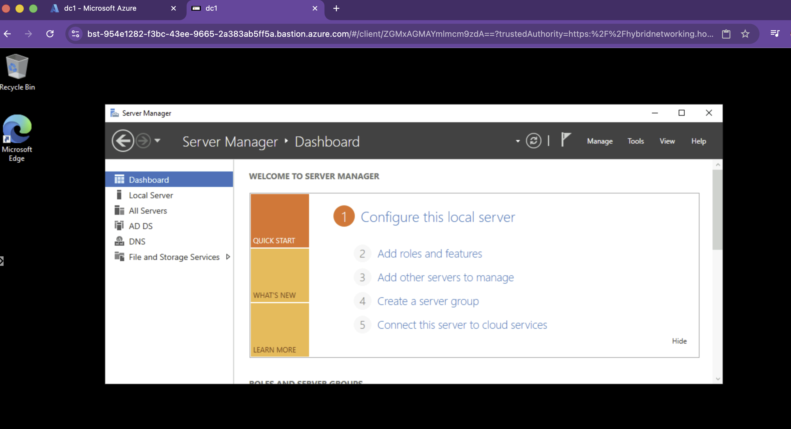
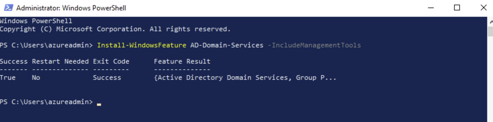
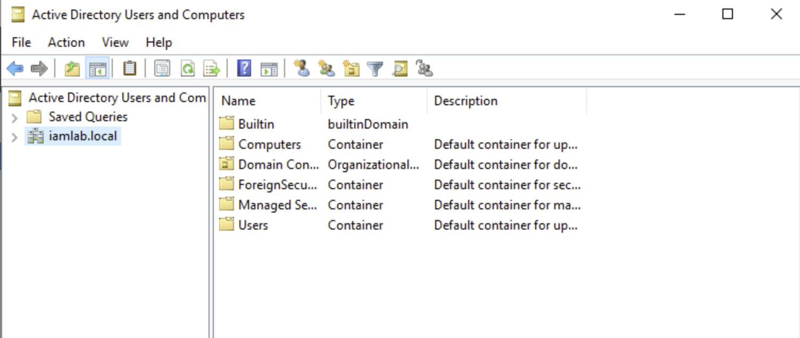
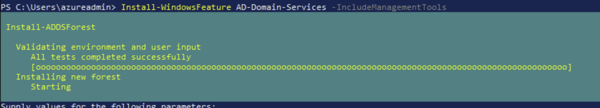

 🛡️ Full IAM AZURE LAB Part 1
---

### Screenshot 1: Infrastructure + Domain Controller

  

**What is shown:**  

Deployed Azure infrastructure using Terraform including resource group,
virtual network, subnet, NSG, Windows Server VM, and Bastion access.

---

### Screenshot 2: Azure Resource Group

**What is shown:**  

All resources deployed in Azure using Infrastructure as Code.
This lab simulates a secure enterprise environment with private networking.
---

### Screenshot 3: Virtual Network / Subnet

**What is shown:**  

Configured virtual network with separate subnets for servers and Bastion.
Network segmentation is required in enterprise and government environments.

---

### Screenshot 4: NSG Rules

**What is shown:** 

Configured Network Security Group rules to restrict inbound traffic.
RDP is only allowed from inside the virtual network for security.

---

### Screenshot 5: VM Running

**What is shown:**  

Deployed Windows Server VM to act as a Domain Controller.
This server will host Active Directory for identity management.

---

### Screenshot 6: Bastion / RDP Connection

**What is shown:**  

Connected securely to the VM using Azure Bastion / RDP.
This allows remote administration without exposing the VM to the internet.

---

### Screenshot 7: AD DS Installed

**What is shown:**  

Installed Active Directory Domain Services on the Windows Server VM.
This allows the server to act as a domain controller.

---

### Screenshot 8: Domain Created

**What is shown:**  

Promoted the server to Domain Controller and created a new Active Directory forest.
Domain name: iamlab.local

---

### Screenshot 9: PowerShell promotion command

**What is shown:**  

Used PowerShell (Install-ADDSForest) to automate domain creation and DNS configuration.

#
